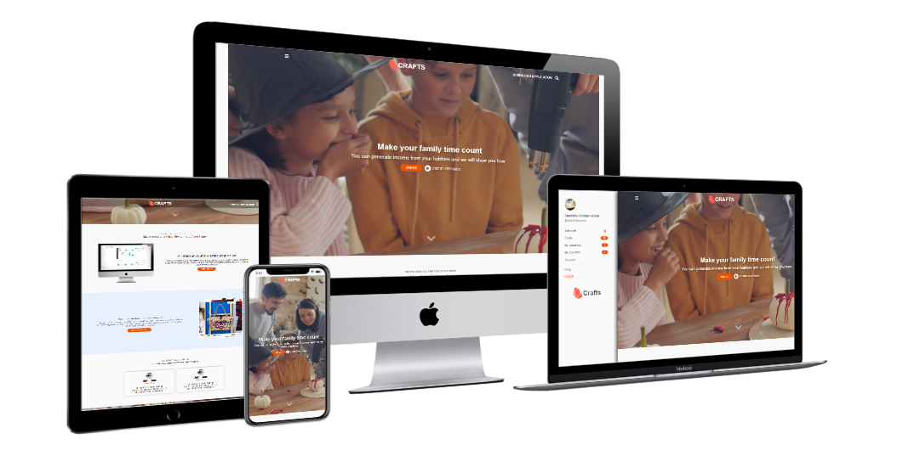

  

# Handcrafts | Convert your hobby to a bussiness

## We recommend visiting this web app from a mobile device, where not possible you can use the mobile view in your browser

> The <b>Crafts</b> mobile web app presents the world's finest Crafts from all around the world. All users can create an account and add their creations, view/like other user's crafts, and contact the creators if interested in their work.
>  
> The APP is created with the latest industry standards using React.js and Redux Toolkit
>  
> API Backend used for data manipulation: [Rails Handmades Backend](https://handmades-rails-api-backend.herokuapp.com/)  
> The app is fully mobile responsive and tested using Jest and the React Testing Library.
>  

## App functionality

- Guests and users can view a catalog of crafts added by users.
- Logged in users can like/favorite crafts, this will automatically add the items to the favorite list and increase the like count for the product.
- Users can click on a product to be routed to the product show page where they can see extra details and contact the creator.
- All the data manipulation and login system is handled by a Rails Backend API

## This web app is live, you can check it here: [Live demo](https://handmades-react-redux-toolkit.herokuapp.com/)

## Screenshot of the app.

## Rails Backend [github link](https://github.com/cristianCeamatu/microverse-handmades-rails-backend-api)

## Project specifications

Project design received from Microverse [here](<https://www.behance.net/gallery/37706679/Circle-(Landing-page-Dashboard-Mobile-App)>), credit at the [bottom](#credits) of this README

## Development

I used Github projects for developing the app, you can see the sprints [here](https://github.com/users/cristianCeamatu/projects/5) for both Backend and Frontend.

## Built With

- React.js
- create-react-app
- Redux Toolkit
- Axios
- Styled components
- Moment.js
- Ruby on Rails for the Backend API
- devise_token_auth for the login functionality

## Testing

- Jest
- React Testing Library

## You can check other react that I built:

- [Recruiting Agency Website](https://aurasjobs-mern.herokuapp.com/)
- [Bookstore - React Redux Toolkit with Rails API backend](https://redux-bookstore199.herokuapp.com/)
- [ReactRedux - Canon Calculator clone](https://codepen.io/crisDevMM/full/ZjqKza)

## Prerequisities

To get this project up and running locally, you must have [node](https://nodejs.org/en/) and [yarn](https://yarnpkg.com/) installed locally.

## Getting Started

**To get this project set up on your local machine, follow these simple steps:**

**Step 1** 
Navigate through the local folder where you want to clone the repository and run 
`git clone https://github.com/cristianCeamatu/microverse-handmades-react-redux-toolkit`. It will clone the repo to your local folder. 
**Step 2** 
Run `cd microverse-handmades-react-redux-toolkit` 
**Step 3** 
Run `yarn install` to install the npm packages from the `package.json` file. 
**Step 4** 
Run `yarn start` to start the webpack server, you can now navigate to `http://localhost:3000` to view the app. The server refreshes the app every time you make a change to a file used by it. 
**Step 5** 
Most important, enjoy the app! 

## Tests

1. Open Terminal

2. Install dependencies (only if you did not install them previously):

   `yarn install`

3. Run the tests with the command:

   `yarn test`

## Authors

👤 **Cristian Viorel Ceamatu**

- Email: [cristian.ceamatu@gmail.com](cristian.ceamatu@gmail.com)
- Github: [https://github.com/cristianCeamatu](https://github.com/cristianCeamatu)
- Twitter: [https://twitter.com/CristianCeamatu](https://twitter.com/CristianCeamatu)
- Linkedin: [https://www.linkedin.com/in/ceamatu-cristian/](https://www.linkedin.com/in/ceamatu-cristian/)

## 🤝 Contributing

Our favourite contributions are those that help us improve the project, whether with a contribution, an issue, or a feature request!

## Show your support

If you've read this far....give us a ⭐️!

## 📝 License

This project is licensed by Microverse and the Odin Project

## Credits

Photos from Vlada Karpovich at Pexels
Video created by Daisy Anderson at Pexels
[Alexey Savitskiy](<https://www.behance.net/gallery/37706679/Circle-(Landing-page-Dashboard-Mobile-App)>) for the design on [behance](<https://www.behance.net/gallery/37706679/Circle-(Landing-page-Dashboard-Mobile-App)>)
